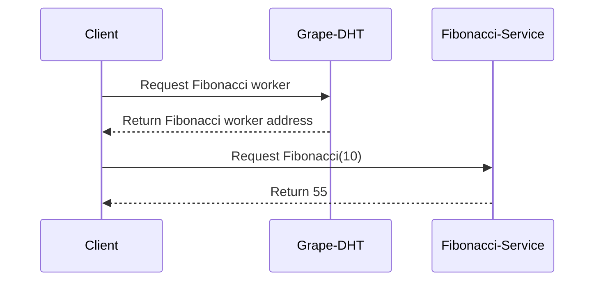

# Fibonacci Microservice with Grenache

This project demonstrates a Fibonacci microservice built with Grenache, a distributed microservices framework based on P2P networking using a Distributed Hash Table (DHT). The service computes Fibonacci numbers and communicates with clients over a peer-to-peer (P2P) network.

[https://blog.bitfinex.com/tutorial/bitfinex-loves-microservices-grenache/](https://blog.bitfinex.com/tutorial/bitfinex-loves-microservices-grenache/)

## 🛠️ Setup

### Prerequisites

- **Node.js** (version 16.x or later)
- **Grenache Grape** (installed globally)

### Install Dependencies

```bash
npm install
```

### Start Grape Nodes (DHT)

To set up the DHT, you need two Grape nodes running. In two separate terminal windows:

**Grape Node 1:**

```bash
grape --dp 20001 --aph 30001 --bn '127.0.0.1:20002'
```

**Grape Node 2:**

```bash
grape --dp 20002 --aph 40001 --bn '127.0.0.1:20001'
```

### 🚀 Run the Fibonacci Microservice

In a new terminal window, run the Fibonacci service:

```bash
node src/server.js
```

This registers the service with the DHT under the name `fibonacci_worker`.

### 🔗 Run the Client

To request a Fibonacci number from the service:

```bash
node src/client.js <number>
```

Example:

```bash
node src/client.js 10
```

The client will send a request to the DHT, find the Fibonacci service, and get the result.

## 🧪 Running Tests

To run the unit and integration tests:

```bash
npm test
```

The tests include error handling, valid inputs, and concurrent requests.

---

## 📜 Project Structure

### Files and Their Roles

- **src/server.js**:  
  The microservice that registers itself on the DHT and responds to client requests with Fibonacci numbers.
- **src/client.js**:  
  The client that connects to the DHT, looks up the `fibonacci_worker`, and requests Fibonacci calculations.
- **src/fibonacci.js**:  
  Contains the logic for calculating Fibonacci numbers.

- **test/**:  
  Contains unit and integration tests for verifying the service and client.

---

## 🔄 P2P Networking Flow

1. The **Grape nodes** form a Distributed Hash Table (DHT) and share information about available services (in this case, the Fibonacci worker).
2. The **Fibonacci service** (server) announces itself to the DHT as `fibonacci_worker`.
3. The **client** sends a request for a Fibonacci number to the DHT, which locates the Fibonacci worker.
4. The **DHT** returns the address of the worker to the client.
5. The **client** connects directly to the Fibonacci service, sending the number to compute.
6. The **Fibonacci service** computes the number and returns the result to the client.

### 🧑‍💻 Sequence Diagram (Mermaid)



---

## 💡 Flow Explanation

- **Grape (DHT):**  
  The DHT maintains a list of peers and services in the network. It allows the client to discover services like the Fibonacci microservice without needing a central server.
- **Fibonacci Service (Server):**  
  The server registers itself as a worker capable of computing Fibonacci numbers. It listens for requests from clients via the DHT and responds with computed results.

- **Client:**  
  The client queries the DHT to locate the Fibonacci service. Once it has the service address, it sends the request directly to the server and gets the result.

---

## 🎯 Conclusion

This project demonstrates a simple P2P microservice architecture using Grenache to perform Fibonacci calculations. It uses a Distributed Hash Table (DHT) for service discovery and communication between peers.
